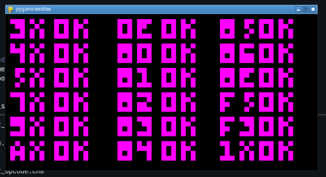

# Chip 8 emulator

Still under development. Created using python and pygame.



## Installation
- Create a virtual environment and install dependencies
```bash
python -m virtualenv venv
source venv/bin/activate
pip install -r requirements.txt
```
## Running
- Run `driver` by specifying a rom name.
`python driver.py test_opcode.ch8`
- Quit with `q`.

## Configuring
- For now, settings have to be changed by editing the code.
- To change screen size, change `screen_scale_factor` in `consts.py`
- Color can be changed by changing `screen_fg` and `screen_bg` in `consts.py`
- Keymap is in `key_mappings` array in `consts.py` file.
- Logging is configured in `log.py`. Change the log level as necessary.
- Log level 1 means every instruction will be printed on screen.

## Todo
- Add support for sound
- Fix framerate issue
- Create a GUI component to allow changing config (open files, change keymap, etc)

## Acknowledgements
- `test_opcode.ch8` from [corax89/chip8-test-rom](https://github.com/corax89/chip8-test-rom) - used under MIT license.
